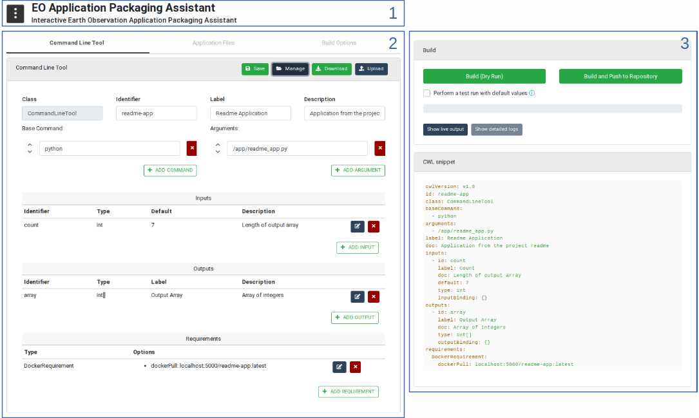
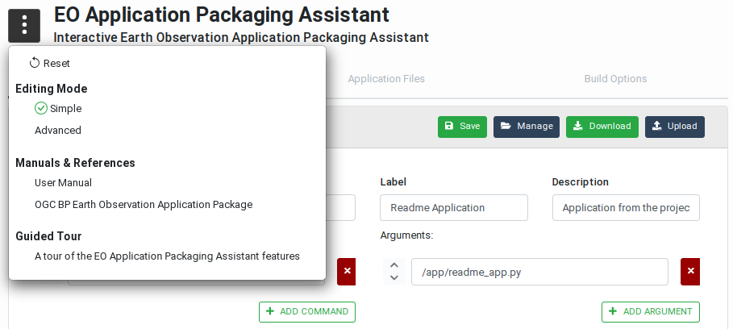
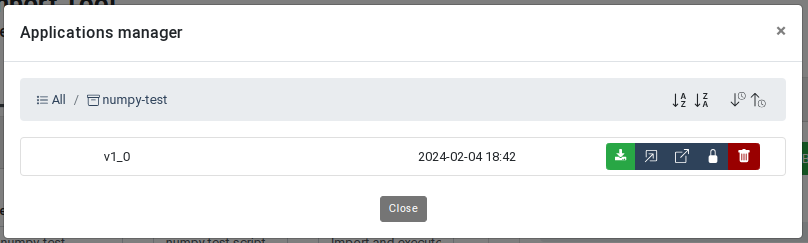
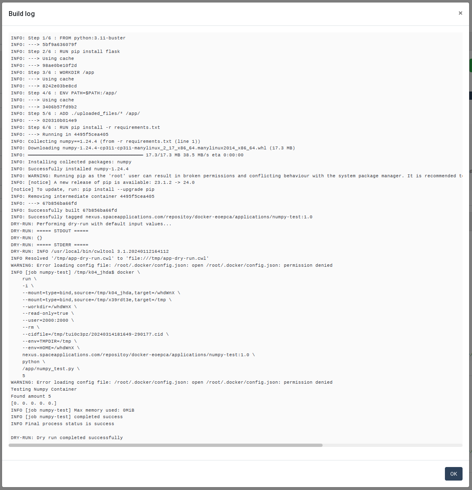

# User Manual

**Abstract**

This document is the User Manual of the EO Application Import Tool. Its purpose is to describe the features and the capabilities supported by the Tool to facilitate its use.

**Online version**

An online version of this documentation is available at https://eoepca.github.io/app-import-tool.

**Abbreviations and Acronyms**

| Abbreviations / Acronyms | Definition                    |
| ------------------------ | ----------------------------- |
| AP                       | Application Package           |
| BP                       | Best Practice                 |
| CLT                      | Command Line Tool             |
| CWL                      | Common Workflow Language      |
| EO                       | Earth Observation             |
| ESA                      | European Space Agency         |
| GUI                      | Graphical User Interface      |
| OGC                      | Open Geospatial Consortium    |

## Introduction 

The Tool is an online web application that allows building Docker images and generating CWL-formatted CLT snippets in an interactive manner. The CLT snippets are generated according to the [OGC Best Practice for Earth Observation Application Package](https://docs.ogc.org/bp/20-089r1.html).

The Tool allows:

- specifying the **Command Line Tool properties** to be included in the CWL snippet. Command Line Tools (also called Processing Tasks) are executable, non-interactive programs that read some inputs, perform a computation, and terminate after producing some outputs.
- uploading the **application implementation files** to be packaged in a Docker image. The files must contain the executable (pre-compile if necessary) code of the program and any configuration and data files required for executing the program. These files are copied in a Docker image during the build operation.
- selecting the **software dependencies** that must also be present in the Docker image to permit the execution of the program. Software dependencies are automatically installed during the build operation.
- performing a **dry-run of the application import** to verify the application is executable in the Docker image without persisting that image.
- executing the **application import** to build, test and persist the Docker image in a Docker repository, and generate the corresponding CWL snippet.

The Tool uses a form based interface for providing or selecting the necessary inputs. The validation and building operations are performed in the back-end and feedback is displayed on the interface in real-time.

The Tool generates a Docker image that contains the application executable files, and a CLT snippet encoded in CWL that contains the CLT properties, including the address of the Docker image.

## CommandLineTool Creation Guidelines

The creation of an application starts with the implementation of the actual processing task. This must be done offline, using inputs available locally and storing generated outputs locally as well. The result consists of:

- the files that implement the processing task,
- the definition of the command line: the main executable, possibly using an interpreted, and its arguments,
- the software dependencies, such as native Linux or Python libraries used by the processing task.

These elements are used in the Application Import Tool to build the Docker image and generate the CWL snippet. 

## Application Import Tool

### Interface Overview

The interface of the Application Import Tool is divided in 3 main sections whose purpose is shown in the Figure *User Interface Overview*:

1. **Header section**: This section inlucdes a drop-down menu that provides users with links and features helping the user to use the Tool.
2.  **Configuration Section**: This is the main section of the Tool used to specify the CLT properties, upload implementation files, and configure the software dependencies. It also contains controls to manage the CLT snippet files generated by the editor. Users here can choose from where to open or save a CWL file as well as edit the name of it and its version.
3.  **Build Section**: This section contains the controls for building the Docker images and generating the CWL snippets. It is possible to proceed with a *dry-run*, meaning the build is performed but the Docker image is not persisted, or with a build followed by the storage of the Docker image in a Docker registry.

Note that if the user screen or browser window is not wide enough, the Build Section automatically moves below the Configuration Section.

*
User Interface Overview
*

### Header Section

The header section provides a helper menu from which users can change general settings of the Application Import Tool, access applicable documents and start guided tours on how to use the user interface. The helper menu provides the following actions as can be seen in the *Helper Menu* figure:

-   **Reset**: Resets the application configuration to a default state, that is without any Application configuration loaded. The user is asked to confirm this action as it may lead to loosing unsaved changes.
-   **Editing Mode**: Allows users to choose between *Simple* and *Advanced* modes. In *Advanced* mode, the forms show optional fields that are not regularly used. By default the *Simple* mode is enabled as it makes the interface look simpler and less complex.
-   **Manuals & References**: Gives users access to applicable documentation such as this User Manual and the OGC Best Practice document for Earth Observation Application Package.
-   **Guided Tour**: Provides users with an interactive guided tour that demonstrates an end-to-end use of the Tool.

*
Helper Menu
*

### File Management Section

The file management buttons located in the Command Line Tool title bar provide users with a set of controls to transfer, save and manage the CWL snippets created using the Application Import Tool. The possible actions are as shown in this figure:

*
File Management Actions
*

#### Workspace Actions: Save and Manage

These actions allow saving and managing Application configuration as CWL files in the Workspace of the current user. Note: this requires the Application Import Tool to be running in an EOEPCA Workspace.

The **Save** button opens a popup dialog box that allows saving the current CLT snippet as a CWL file in the user Workspace. In this box, users can change the snippet name and version before performing the save.

*
Application Save Popup
*

The **Manage** button opens a manager that allows users to explore and manage the Applications saved in their workspace. Users have the possibility to navigate between Applications and see the saved versions. This manager also provides version specific actions that allow the user to **open, lock, unlock, delete and download** each Application version.

*
Application Manager
*

*
Application Versions Manager
*

#### Transfer Actions

These actions allow users to transfer Application CWL files from their local storage to the Tool and vice versa.
Two actions are available:

-   **Upload**: The upload button allows users to directly load an Application CWL file from their local storage in order to edit it using the Application Import Tool.
-   **Download**: The download button allows users to download the Application currently loaded in the Application Import Tool as a CWL file on the local system.

#### Combining Actions

The workspace and transfer actions can be used together meaning that a user can transfer an Application CWL file from his local storage to the Tool and then save it directly in his Workspace and vice versa.

### Configuration Section

The **Configuration Section** is the main section of the Application Import Tool and consists of three sub-pages titled **Command Line Tool**, **Application Files** and **Build Options**, as shown in the next figure. More information about these tabs are available by clicking the information icons next to the tab name.

#### Command Line Tool

The **Command Line Tool** tab in the editor section allows users to specify the properties of the processing task, including the executable program name, inputs, outputs and requirements that must be met in order to execute
the processing task.

As shown in the *Editor Command Line Tool Tab* figure, a user can:

1.  Enter an identifier for the processing task. This identifier is mandatory as it allows referring to the processing tasks when integrated as jobs in a CWL workflow. Note that the class of the process is set to `CommandLineTool` and cannot be changed. A human-friendly label and description may also be entered as this will be more informative to the users who want to use this application in their workflows.
2.  Specify the program to execute to process the inputs. If defined as an array, the first element of the array is the command to execute, and subsequent elements are mandatory command line arguments.
3.  Specify the command line bindings which are not directly associated with input parameters.
4.  Define the inputs of the processing task with their id, type, default value and input bindings. Note that providing inputs default values is not mandatory but allows verifying the program can be executed during the build process (as explained in the [Build section](#build-panel), below).
5.  Define the outputs of the processing task with their identifier, type, and output bindings.
6.  Add the requirements that must be met in order to execute the processing task. Note: The Application Import Tool will automatically insert a `DockerRequirement` when the application Docker image is built.

Note that the content of the inputs and outputs configuration forms highly depends on the editing mode (explained in the [Header Section](#header-section)). If you are missing options in these forms, switch to the Advanced mode in the Helper Menu.

*
Command Line Tool Tab
*

#### Application Files

The **Application Files** tab contains a drop-zone that allows users upload the files implementing the program. These may include native (pre-compiled) executable files, scripts, configuration and data files. The files may be dragged and dropped on the drop-zone, but clicking on that area also reveals a file selection box that allows navigating and selecting the files to be uploaded.

All regular files uploaded this way will be copied in the same folder in the application Docker image.

Two special mechanisms are also supported:

- If a file named `requirements.txt` is uploaded, this is used during the build process to install the Python packages listed in it (i.e. using the standard `pip` command).

- Uploaded `*.tar` or `*.tgz` files are automatically inflated during the build process. This allows copying a high amount of files at once as well as organising the program files in a folder hierarchy.

Files uploaded by mistake cannot be removed individually. Click on the **Remove All Files** button before uploading the correct files again.

On the following figure two files have been uploaded in the drop-zone: `numpy_test.py` and `requirements.txt`:

*
Application Files Tab
*

#### Build Options

The **Build Options** tab allows specifying the software tools and libraries required to execute the program in the application Docker image and the repository where the Docker image must be pushed.

**Software Dependencies**

As explained above, Python packages may be installed by including a `requirements.txt` file in the application files, however this does not allow installing native libraries, for example.

Note: The available software dependencies depend on the actual configuration of the Application Import Tool. Different platforms may propose different options. Instructions for configuring the Tool may be found in the [GitHub `README`](https://github.com/eoepca/app-import-tool).

Click on the "Software Dependencies" list to reveal the pre-configured dependencies and select the ones that are required. Internally, the Tool takes care of cross-dependencies and incompatibilities. If a selected software is incompatible with others, these are grayed out in the list.

**Registry**

The **Registry** form allows indicating where the generated Docker image must be pushed after a successful build. Two options are provided:

- When **Default Service Registry** is selected, the default registry configured in the Application Import Tool is used. Note that this relies on how the Tool has been configured (see [GitHub `README`](https://github.com/eoepca/app-import-tool)).

- When **Custom Registry** is selected, the user may enter the address of a publicly accessible Docker registry (for both pulling and pushing Docker images). The address may contain the path to be prepended to the Docker image name.

The name of the generated Docker image will always contain the identifier of the application. The **Image tag** field allows entering a custom tag for differenciating different versions of the application.

When a custom registry is used, the resulting image address is: `<registry-name>/<image-path>/<image-identifier>:<image-tag>`

In the following figure, the **Flask** software is selected. Its availability will be verified by executing the `/app/numpy_test.py` script as configured in the Command Line Tool panel.

*
Build Options Tab
*

### Build Section

The **Build Section**, located on the right side of the page, provides the buttons to trigger the build process and accessing the corresponding logs.

*
Build Section
*

#### Build Panel

The **Build** panel contains the following elements:

- A **Build (Dry Run)** button allows building a Docker image copying (and extracting if necessary) the uploaded application files and installing the selected software dependencies. When the build is complete, the Docker image is deleted and not persisted in a registry.
- The checkbox **Perform a test run with default values** allows requesting the application program to be actually executed in a Docker container using the default values given to the application input parameters. Note: For this option to be available, all the mandatory parameters must have been given a default value (in the [Command Line Tool](#command-line-tool) tab). **It is recommended to the application developers to take this into account and foresee in their program code the detection of the default values in order to perform some sanity checks instead of a real processing**. Real processing would likely fail anyway as no input files are actually stated-in during a test run. Performing a test run is helpful, for example, to verify that all the Python libraries necessary to running the program may be imported.
- The **Build and Push to Repository** button is used to trigger the build of a Docker image, perform a test run if requested, and if successful, push the new image in the Docker registry selected by the user.

**Live outputs** may be displayed during the build process. Internally, more detailed logs are collected. These may be obtained when the build process is complete (successfully or not), by clicking on the **Show detailed logs** button.

*
Build Live Output
*

*
Build Success
*

Detailed logs are displayed in a popup dialog box when the **Show detailed logs** button is clicked. The log text may be copied as necessary:

*
Build Detailed Logs
*

#### CWL Snippet Panel

This panel displays the CWL snippet synchronised with the application properties entered in the [Command Line Tool](#command-line-tool) form. The view is updated after every action of the user in the form.

The `DockerRequirement` entry and the `dockerPull` property are also automatically inserted after a successful build.

*
Command Line Tool CWL Snippet
*

